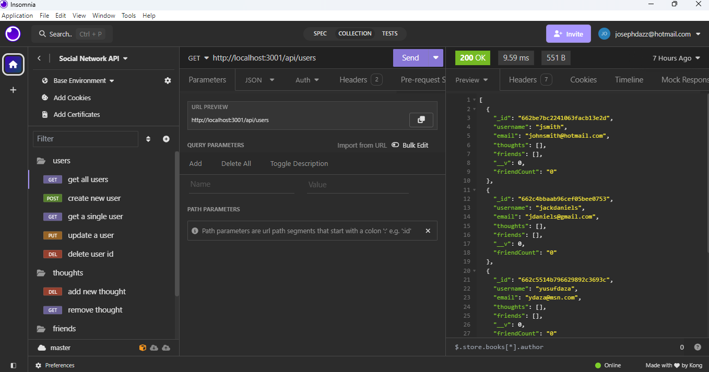

# Social Network API

## Description

### What was your motivation?
- The motivation was to create an API for a social network startup that could handle large amounts of unstructured data. This reflects the common need in social media platforms where user-generated content varies widely.

### Why did you build this project? 
- The project was built to address the scalability and flexibility challenges faced by social media startups. By using a NoSQL database like MongoDB and designing an API around it, the goal was to efficiently manage and scale as the user base and data volume grow.

### What problem does it solve?
- The project solves the problem of handling unstructured data efficiently. NoSQL databases like MongoDB are well-suited for this purpose, making them a good choice for social networks where data formats can vary greatly. By using MongoDB and designing an API around it, the social network can effectively manage and scale as it grows.

### What did you learn?
- From this project, I learned about NoSQL databases and their advantages over traditional SQL databases for handling unstructured data. I also gained experience in API design, data modeling using Mongoose for MongoDB, API testing with tools like Insomnia, and understanding scalability considerations for social media platforms.

## Installation

1. Install Node.js and npm.
2. Install MongoDB.
3. Create a new Node.js project on your terminal.
4. Initialize the Node.js project.

## Usage

1. Create the server and define routes. 
2. Open `server.js` and set up your Express server and define your API routes.
3. Start MongoDB by running the following command: `mongod`.
4. Test API endpoints with Insomnia:
    - GET Users: Send a GET request to http://localhost:3000/users to retrieve a list of users.
    - POST Users: Send a POST request to http://localhost:3000/users with JSON data in the body to create a new user.
    - GET Thoughts: Send a GET request to http://localhost:3000/thoughts to retrieve a list of thoughts.
    - POST Thoughts: Send a POST request to http://localhost:3000/thoughts with JSON data in the body to create a new thought.
    - PUT Thoughts: Send a PUT request to http://localhost:3000/thoughts/{thoughtId} to update an existing thought.
    - DELETE Thoughts: Send a DELETE request to http://localhost:3000/thoughts/{thoughtId} to delete a thought.
5. Testing Reactions and Friend Requests with Insomnia.

## Screenshot

    
## Features

<a href="https://insomnia.rest/">Insomnia</a>

<a href="https://www.mongodb.com/try/download/community">MongoDB</a>

## MIT License

Copyright (c) 2024 Joseph Daza

Permission is hereby granted, free of charge, to any person obtaining a copy
of this software and associated documentation files (the "Software"), to deal
in the Software without restriction, including without limitation the rights
to use, copy, modify, merge, publish, distribute, sublicense, and/or sell
copies of the Software, and to permit persons to whom the Software is
furnished to do so, subject to the following conditions:

The above copyright notice and this permission notice shall be included in all
copies or substantial portions of the Software.

THE SOFTWARE IS PROVIDED "AS IS", WITHOUT WARRANTY OF ANY KIND, EXPRESS OR
IMPLIED, INCLUDING BUT NOT LIMITED TO THE WARRANTIES OF MERCHANTABILITY,
FITNESS FOR A PARTICULAR PURPOSE AND NONINFRINGEMENT. IN NO EVENT SHALL THE
AUTHORS OR COPYRIGHT HOLDERS BE LIABLE FOR ANY CLAIM, DAMAGES OR OTHER
LIABILITY, WHETHER IN AN ACTION OF CONTRACT, TORT OR OTHERWISE, ARISING FROM,
OUT OF OR IN CONNECTION WITH THE SOFTWARE OR THE USE OR OTHER DEALINGS IN THE
SOFTWARE.

